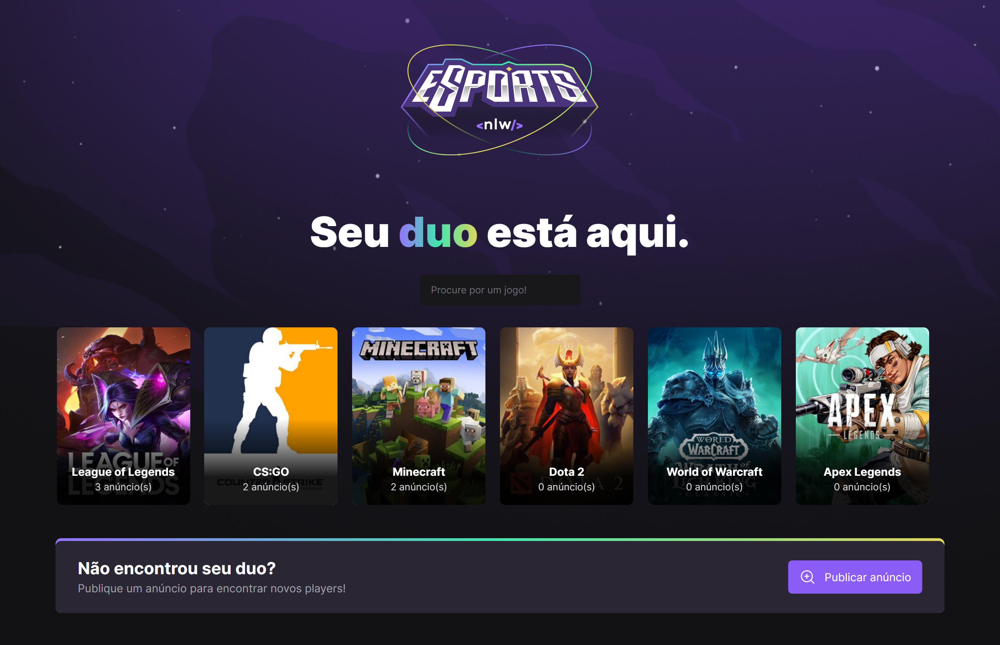
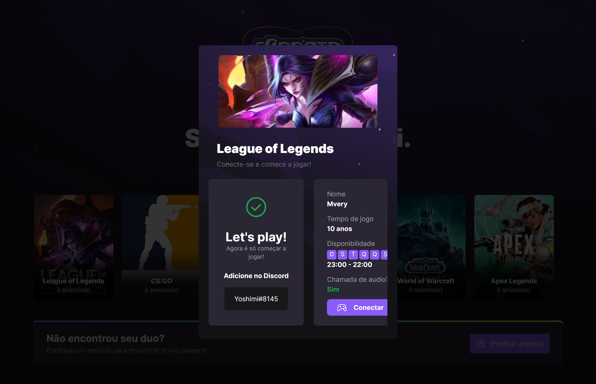
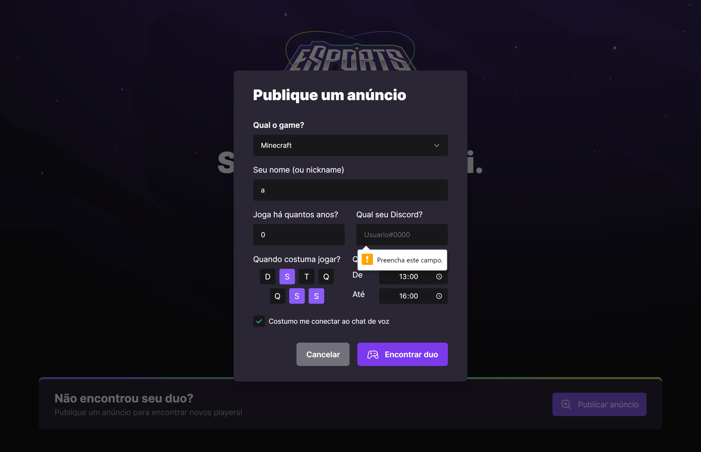
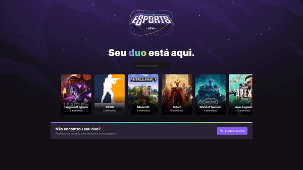
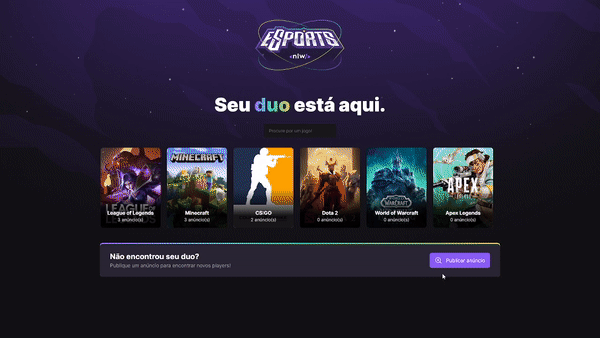

# # Trilha Ignite - RocketSeat

Exercicio do evento NLW - eSports na Trilha Ignite realizado pela [Rocketseat](https://www.rocketseat.com.br/) onde foi feito a criação de uma plataforma para conectar pessoas para jogarem juntas, na qual é possível criar anúncios e consultar de outros jogadores querendo se conectar, com a ajuda de um Database onde as informações dos anúncios ficam registradas.

Exercise from event NLW - eSports on Ignite Trail held by [Rocketseat](https://www.rocketseat.com.br/) where a platform was created to connect people who wants to play together, in which it is possible to create ads and consult others players wanting to connect, with the help of a Database where the ads information are stored.

## Screenshots and Gifs

## Tech Stack

ReactJS
Typescript
Tailwind
Axios